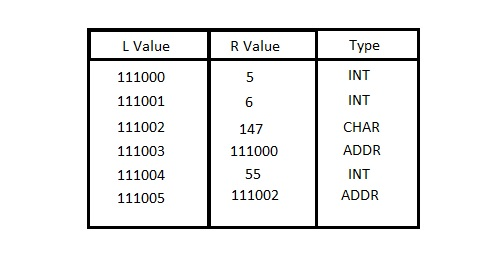

# MagicTable - Illuminating pointers with a Table
MagicTable datastructure to replace conventional pointers

A magic table has 3 columns 1st is L value, 2nd R value and 3rd is type

init_magic_table() is to fill the table during start of the program

fill_magic_table() is to fill the L value of the table only

genAddr() will generate dummy addresses

addr_of() is similar to "&" in C language to get the address

assign() is similar to "*ptr =" in C language to assign value & type to the pointer

deref() is similar to "*ptr" in C language to dereference the pointer using L value and get the value from R value of the table 
